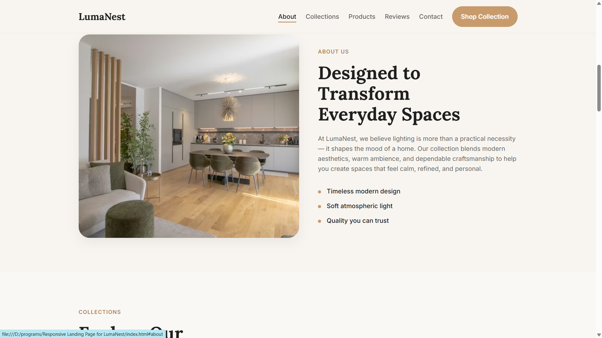
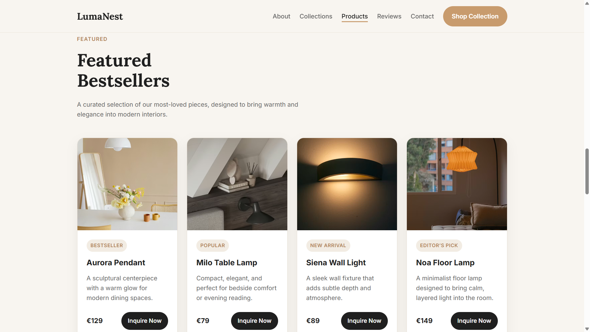
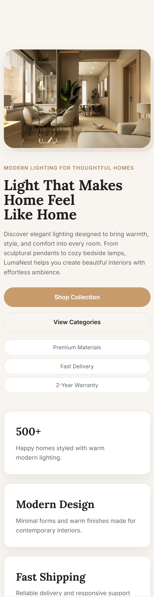

# LumaNest — Responsive Landing Page

A modern responsive landing page for a fictional interior lighting brand.

Built with HTML, CSS, and JavaScript, focused on clean UI, responsive layouts, and modern product presentation.

## Live Demo

https://bogdanbedrinec.github.io/lumanest-landing-page/

## Features

- Responsive design
- Modern UI layout
- Product showcase section
- Smooth navigation
- Mobile-friendly interface
- Clean typography and spacing

## Technologies Used

- HTML5
- CSS3
- JavaScript

## Screenshots

### Desktop

### Mobile

## Author

Bohdan Bedrynets